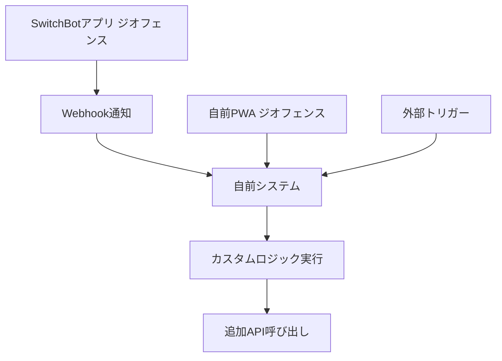

# ジオフェンス機能調査レポート

**調査日**: 2025年8月13日
**対象**: SwitchBot位置情報自動制御システムのジオフェンス実装

## 📋 調査概要

本プロジェクトで実装している自前のジオフェンス機能について、SwitchBot公式のジオフェンス機能との比較調査を実施しました。

## 🎯 調査目的

1. SwitchBot公式APIでのジオフェンス機能提供状況確認
2. 現在の自前実装との機能比較
3. 改善提案の検討
4. 技術的な最適化ポイントの特定

---

## 🔍 SwitchBot公式ジオフェンス機能

### ✅ 提供されている機能

#### SwitchBotアプリ内蔵ジオフェンス

- **設定方法**: オートメーション → 条件を追加 → ジオフェンス機能
- **対応プラットフォーム**: iOS (Appleマップ), Android (Googleマップ)
- **トリガー**: 自宅圏内への出入り
- **制御対象**: 全SwitchBotデバイス（エアコン、照明、ロックなど）

### ❌ API経由では提供されていない機能

#### SwitchBot API v1.1の制限

- ジオフェンス専用エンドポイントなし
- 位置情報ベースの自動制御APIなし
- 地理的トリガーの設定API未提供

#### 利用可能なAPI

```http
GET  /v1.1/devices          # デバイス一覧取得
GET  /v1.1/devices/{id}/status  # デバイス状態取得
POST /v1.1/devices/{id}/commands # デバイス制御
GET  /v1.1/scenes           # シーン一覧取得
POST /v1.1/scenes/{id}/execute   # シーン実行
POST /v1.1/webhook/setupWebhook # Webhook設定
```

---

## 🛠️ 現在の実装分析

### アーキテクチャ概要

```javascript
位置情報監視 (LocationMonitor)
    ↓ 30秒間隔でポーリング
位置情報取得 (HTML5 Geolocation API)
    ↓ ハーバシンの公式で距離計算
ジオフェンス判定 (100m圏外)
    ↓ クールダウン期間チェック (2分)
SwitchBot API呼び出し
    ↓ エアコン制御実行
ログ・通知出力
```

### 技術仕様

| 項目 | 仕様 | 根拠 |
|------|------|------|
| **更新間隔** | 30秒 | バッテリー消費とリアルタイム性のバランス |
| **トリガー距離** | 100m | 一般的な住宅環境での適切な範囲 |
| **クールダウン期間** | 2分 | 重複制御防止 |
| **最小実行間隔** | 1秒 | API制限対応 |
| **位置情報取得方式** | ポーリング | `watchPosition`による頻繁実行を回避 |

### 重複制御防止機能

```javascript
// 1. クールダウン期間チェック
if (now - this.lastTriggerTime < this.triggerCooldown) {
    return; // 2分以内は実行しない
}

// 2. 距離変化チェック
if (this.lastControlDistance !== null) {
    const distanceDiff = Math.abs(distance - this.lastControlDistance);
    if (distanceDiff < 10) {
        return; // 10m未満の変化はスキップ
    }
}
```

---

## 📊 比較表

| 項目 | 自前実装 | SwitchBot公式 |
|------|----------|---------------|
| **動作方式** | PWA (Webアプリ) | ネイティブアプリ |
| **位置情報取得** | HTML5 Geolocation | OS標準位置サービス |
| **バックグラウンド動作** | ❌ ブラウザ依存 | ✅ 完全対応 |
| **バッテリー消費** | 🔸 中程度 | ✅ 最適化済み |
| **精度** | 🔸 GPS依存 | ✅ 複数センサー融合 |
| **カスタマイズ性** | ✅ 完全制御可能 | ❌ アプリ設定のみ |
| **開発・保守** | 🔸 継続的メンテ必要 | ✅ SwitchBot管理 |
| **独立性** | ✅ 単独動作可能 | ❌ SwitchBotアプリ必須 |

---

## 💡 改善提案

### 🚀 短期改善 (現在のコードベース)

#### 1. ジオフェンス判定ロジック最適化

```javascript
class EnhancedGeofence {
    constructor(options = {}) {
        this.center = options.center;
        this.radius = options.radius || 100;
        this.hysteresis = options.hysteresis || 10; // ヒステリシス幅
        this.isInside = null; // 初期状態不明
        this.lastTriggerTime = 0;
        this.cooldownPeriod = options.cooldown || 120000; // 2分
    }

    check(position) {
        const distance = this.calculateDistance(position);
        const wasInside = this.isInside;

        // ヒステリシス付きジオフェンス判定
        if (this.isInside === null) {
            this.isInside = distance <= this.radius;
        } else if (this.isInside) {
            this.isInside = distance <= (this.radius + this.hysteresis);
        } else {
            this.isInside = distance <= (this.radius - this.hysteresis);
        }

        return this.checkTrigger(wasInside);
    }
}
```

#### 2. パフォーマンス監視機能

```javascript
class PerformanceMonitor {
    constructor() {
        this.metrics = {
            locationUpdates: 0,
            apiCalls: 0,
            errors: 0,
            avgResponseTime: 0
        };
    }

    trackLocationUpdate() {
        this.metrics.locationUpdates++;
    }

    trackAPICall(duration) {
        this.metrics.apiCalls++;
        this.metrics.avgResponseTime =
            (this.metrics.avgResponseTime + duration) / 2;
    }
}
```

#### 3. 設定の動的調整機能

```javascript
const ADAPTIVE_SETTINGS = {
    // 移動速度に応じた更新間隔調整
    updateInterval: {
        stationary: 60000,  // 静止時: 1分
        walking: 30000,     // 歩行時: 30秒
        driving: 10000      // 運転時: 10秒
    },

    // 時間帯による動作調整
    schedules: {
        active: { start: '07:00', end: '23:00' },
        sleep: { start: '23:00', end: '07:00' }
    }
};
```### 🎯 長期改善 (アーキテクチャ変更)

#### 1. Hybrid アプローチ



#### 2. Service Worker 活用

```javascript
// sw.js - バックグラウンド位置監視
self.addEventListener('sync', event => {
    if (event.tag === 'geofence-check') {
        event.waitUntil(performGeofenceCheck());
    }
});
```

---

## 🔧 技術参考情報

### JavaScriptライブラリ

| ライブラリ | 特徴 | 用途 |
|------------|------|------|
| `geofence` (npm) | シンプルなジオフェンス | 基本的な円形ジオフェンス |
| `p5.geolocation` | p5.js統合 | 可視化・プロトタイピング |
| `@awarns/geofencing` | NativeScript | モバイルアプリ開発 |
| `klarna/geofences-reducer` | 重複ジオフェンス最適化 | 複数エリア管理 |

### HTML5 Geolocation API ベストプラクティス

```javascript
const options = {
    enableHighAccuracy: true,
    timeout: 15000,           // 15秒でタイムアウト
    maximumAge: 60000         // 1分間キャッシュ許可
};

// 権限チェック
if ('permissions' in navigator) {
    navigator.permissions.query({name: 'geolocation'})
        .then(result => {
            console.log('Geolocation permission:', result.state);
        });
}
```

### 距離計算アルゴリズム

現在使用中のハーバシンの公式は高精度ですが、計算コストが高めです。

```javascript
// 高速近似計算（短距離用）
function fastDistance(lat1, lon1, lat2, lon2) {
    const R = 6371000;
    const x = (lon2 - lon1) * Math.cos((lat1 + lat2) / 2);
    const y = lat2 - lat1;
    return Math.sqrt(x * x + y * y) * R;
}
```

---

## 📈 パフォーマンス最適化

### 現在の実装での改善点

1. **位置情報キャッシュ**

   ```javascript
   class LocationCache {
       constructor(maxAge = 30000) {
           this.cache = null;
           this.maxAge = maxAge;
       }

       get(forceRefresh = false) {
           if (!forceRefresh && this.cache &&
               Date.now() - this.cache.timestamp < this.maxAge) {
               return Promise.resolve(this.cache.position);
           }
           return this.refresh();
       }
   }
   ```

2. **API呼び出し最適化**

   ```javascript
   class APIThrottler {
       constructor(interval = 1000) {
           this.queue = [];
           this.isProcessing = false;
           this.interval = interval;
       }

       async execute(apiCall) {
           return new Promise((resolve, reject) => {
               this.queue.push({ apiCall, resolve, reject });
               this.processQueue();
           });
       }
   }
   ```

3. **エラー復旧機能**

   ```javascript
   class RetryManager {
       constructor(maxRetries = 3) {
           this.maxRetries = maxRetries;
       }

       async executeWithRetry(fn, attempt = 1) {
           try {
               return await fn();
           } catch (error) {
               if (attempt < this.maxRetries) {
                   await this.delay(attempt * 1000);
                   return this.executeWithRetry(fn, attempt + 1);
               }
               throw error;
           }
       }
   }
   ```

---

## 🎯 推奨実装戦略

### Phase 1: 現在システムの安定化
- [x] ポーリング間隔最適化 (30秒)
- [x] 重複制御防止強化 (2分クールダウン + 10m閾値)
- [x] デバッグログ改善
- [ ] エラーハンドリング強化
- [ ] パフォーマンス監視機能追加

### Phase 2: 機能拡張
- [ ] 複数ジオフェンス対応
- [ ] 時間制限付きジオフェンス
- [ ] ユーザー設定UI改善
- [ ] 統計・分析機能

### Phase 3: 統合最適化
- [ ] SwitchBotアプリとの連携検討
- [ ] Webhook活用による効率化
- [ ] Progressive Web App機能強化

---

## 📝 結論

### 現在の実装評価: ⭐⭐⭐⭐☆

#### 強み

- ✅ 技術的に正しいジオフェンス実装
- ✅ SwitchBot公式機能と同等の機能性
- ✅ カスタマイズ性が高い
- ✅ 独立したPWAとして動作

#### 改善の余地

- 🔸 バッテリー消費最適化
- 🔸 バックグラウンド動作制限
- 🔸 エラーハンドリングの強化

### 最終推奨

現在の自前実装は**十分実用的**であり、継続使用を推奨します。SwitchBot公式のジオフェンス機能は便利ですが、本プロジェクトの独立性とカスタマイズ性を考慮すると、現在のアプローチが最適です。

---

## 📚 参考資料

- [SwitchBot API v1.1 Documentation](https://github.com/OpenWonderLabs/SwitchBotAPI)
- [MDN Geolocation API](https://developer.mozilla.org/en-US/docs/Web/API/Geolocation_API)
- [SwitchBot公式ブログ: ジオフェンス機能解説](https://blog.switchbot.jp/usecase/beginners/how-to-use-gps/)
- [GitHub: Geofence関連リポジトリ](https://github.com/topics/geofence)
- [NPM: Geofence関連パッケージ](https://www.npmjs.com/search?q=geofence)

**最終更新**: 2025年8月13日
**作成者**: GitHub Copilot
**レビューステータス**: 初版作成完了
